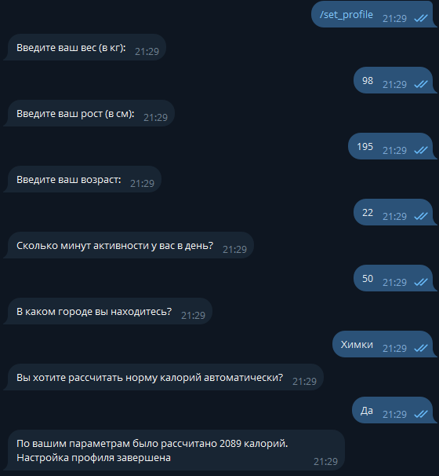
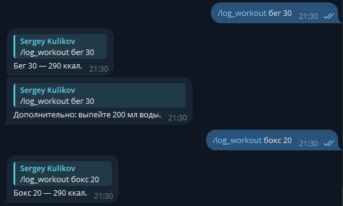
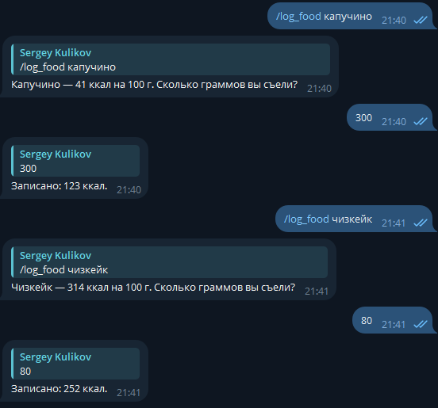
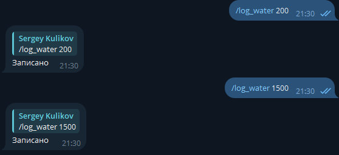
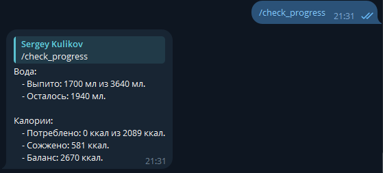

# HSE_adv_python_hw_2

## Tokens
### В файле .env нужно добавить  
```
BOT_TOKEN=<tg bot token>  
CALORIENINJAS=<https://calorieninjas.com token>  
OPENWEATHER_TOKEN=<https://openweathermap.org token>  
RAPID_TOKEN=<https://rapidapi.com/apininjas/api/calories-burned-by-api-ninjas token>  
```

## Запуск  
```
pip install -r requirements.txt
python app.py
```

## Скриншоты работы

Настройка профиля пользователя  


Логирование тренировок  



Логирование еды  


Логирование воды  



Прогресс по воде и калориям  

